# Odd-One-Out Depth (O3-D)
🤗 [O3-D dataset](https://huggingface.co/datasets/liuyiqian/O3-D) | 📄 [Paper (accepted to ECCV 2026)](https://arxiv.org/abs/2607.01503)

We study depth perception of vision-language models (VLMs) to isolate the effects of 9 pictorial depth cues and disentangle vision and language influences on model performance.


<figure>
    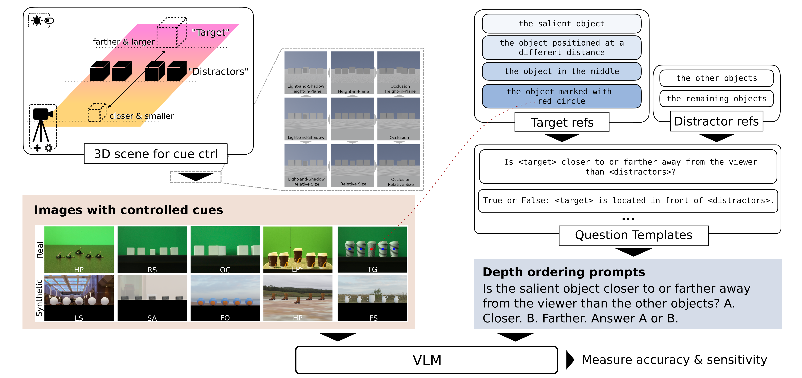
    <figcaption><em>
    O3-D probes VLM depth and language understanding. Each <code>3D scene</code> contains 5 objects of the same class, one of which (the target) is of different size and placed at a different depth plane conformed to scale ambiguity. We then generate a number of <code>2D views</code> with one or two depth cues by controlling the camera, light position, etc. For each image, we pair it with one of the depth-ordering <code>prompt</code> templates, within which we vary the <code>target</code> and <code>distractor</code> referring expressions.
    </em></figcaption>
</figure>

## Outline

- [Results](#results)
- [Methodology](#methodology)
- [Code](#code)
- [BibTex](#bibtex)

## Results
We run 12 VLMs on O3-D and evaluate their Visual Question Answering (VQA) performance on various
question formats and pictorial cues.

### Performance summary
<figure>
    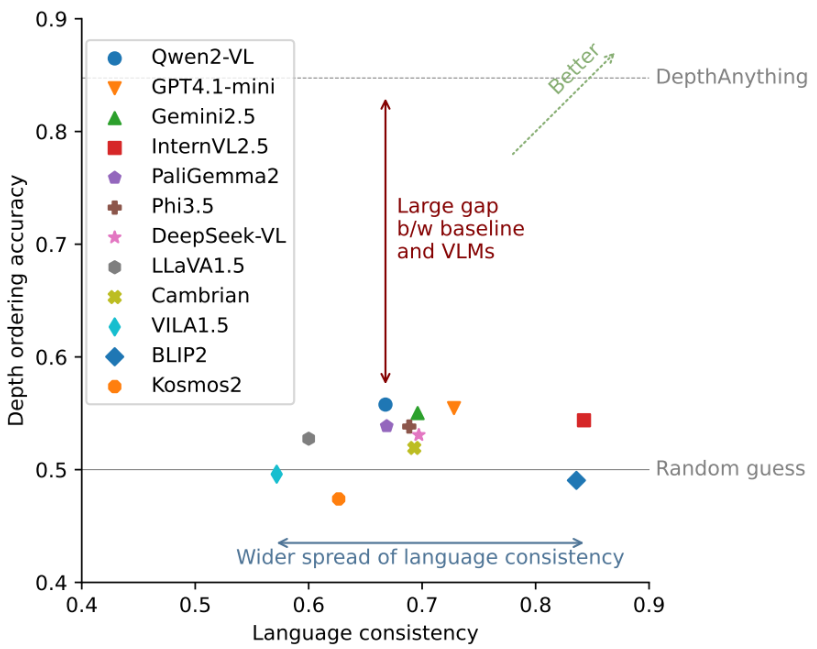
</figure>

Overall findings:

- [Depth ordering accuracies](#accuracy-metric) of VLMs are close to random guess and inferior to DepthAnythingV2 baseline.
- VLMs' [language consistency](#sdgm-metrics) has a wide spread.
- [In-context learning and chain-of-thought prompting](#in-context-learning-icl--chain-of-thoughts-cot) helps commercial VLMs only, with limited improvements.
- [Referring clarity](#visual-question-prompts) slightly improves depth ordering.

### Combined heatmap of 1-cue & 2-cue performance
The figure below combines mean accuracies of VLMs (bottom-left), *vs.* baseline (top-right). <span style="color:darkred">Red</span>- and <span style="color:steelblue">blue</span>-tinted cells indicate performance
<span style="color:darkred">above</span> and <span style="color:steelblue">below</span> chance level (0.5). The two main diagonal cells (within green dotted rectangle) show accuracies for 1-cue depth ordering, whereas the other cells report 2-cue interactions. Linear perspective (LP) cue requires special treatment, as detailed in [Supplementary Materials](https://arxiv.org/abs/2607.01503). (For cue abbreviations, see [Glossary](#glossary))
<figure>
    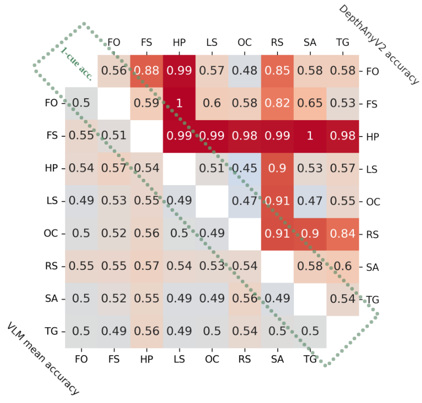
</figure>

Pictorial depth cue-level findings:

- The [depth ordering performance](#accuracy-metric) improves whenever height (HP) or size (RS) cue is present.
- Occlusion (OC) is the most underutilized cue.


### Vision *vs.* language influence
Bars below show the standard deviation of mean accuracies ([SDGM](#sdgm-metrics)), as a measure of influence.
<figure>
    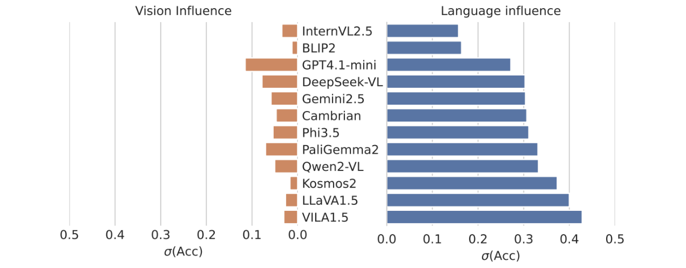
</figure>

Vision *vs.* language insights:

- Across VLMs, [language influence](#sdgm-metrics) is uniformly larger than vision.
- InternVL2.5 is the most vision-language balanced model.

## Methodology
This section describes how we [prepare data](#data) and [evaluate VLMs](#evaluation).

> [!NOTE]
> Data is publicly available at 🤗 [O3-D dataset](https://huggingface.co/datasets/liuyiqian/O3-D).


### Data Preparation

#### Pictorial depth cues
We study 9 common pictorial depth cues: Occlusion (OC), Relative Size (RS), Aerial Perspective/Saturation (SA),
Texture Gradient (TG), Linear Perspective (LP), Height-in-Plane (HP), Familiar Size (FS), Light-and-Shadow (LS), and Focusness (FO).

<p align="center">
  
  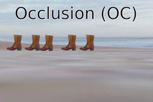
  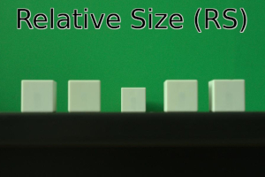
  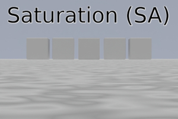
  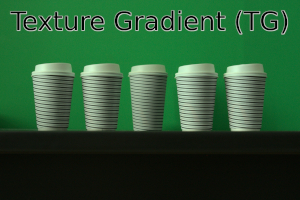
  <br/>
  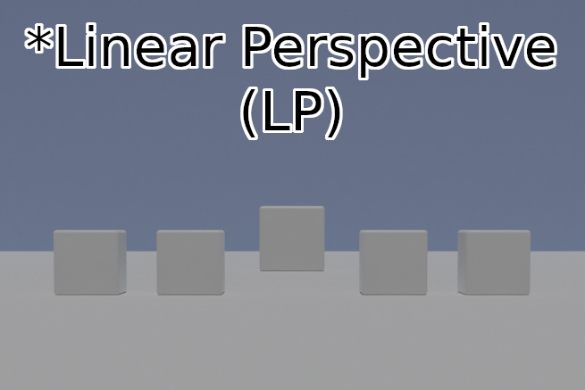
  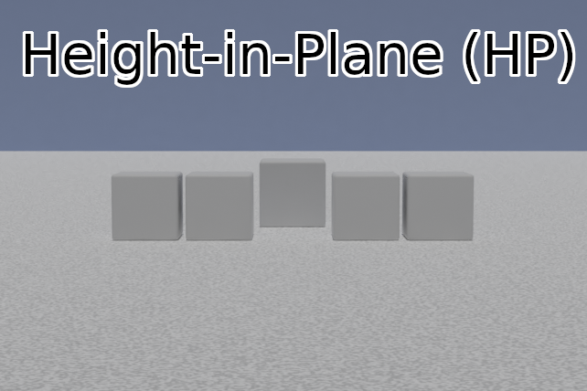
  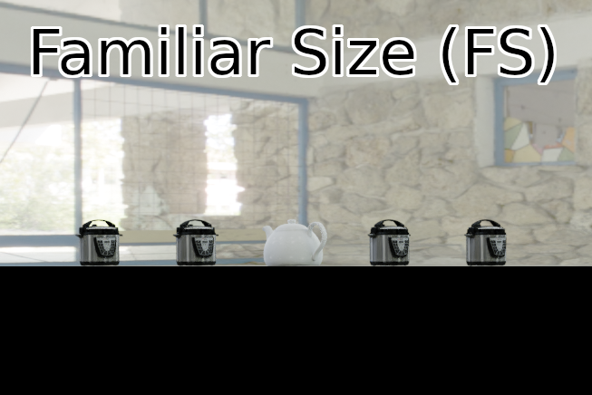
  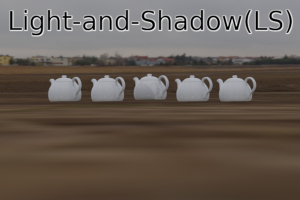
  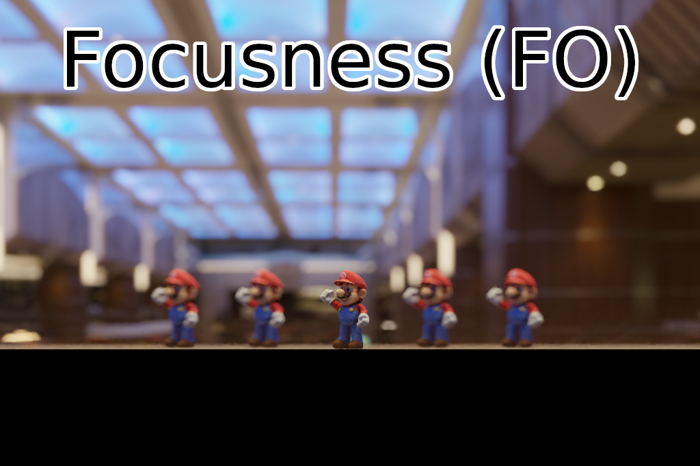
</p>


#### Scene construction & cue control
<figure>
    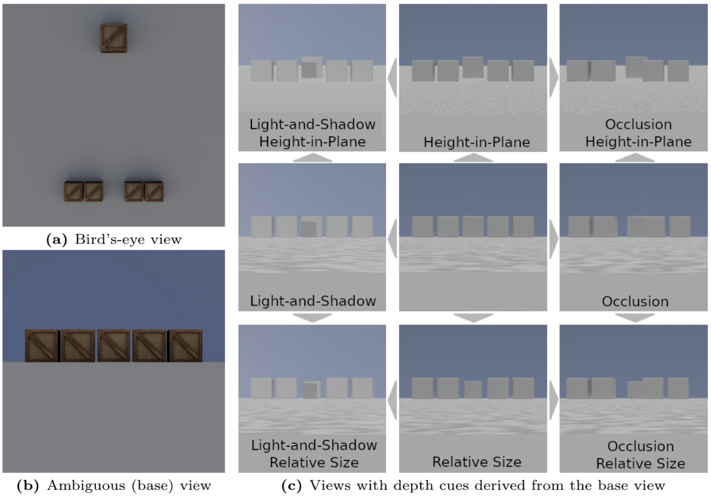
</figure>

Each 3D scene in O3-D contains 1 target and 4 distractors, where the target is
larger (or smaller) and located on a different depth plane *(a)*. When a camera is placed
at a certain position, *(b)* the target appears at the same depth as the distractors. *(c)*
Gray arrows between the images indicate how disambiguated 2D views are generated
from the base view (in the center) by introducing one or two pictorial depth cues.


#### Visual question prompts
We generate a template-based question space of 1,026 unique depth-ordering prompts, with variations in 4 dimensions: 1) prompt template, 2) target referring, 3) distractor referring, and 4) response instruction. Along the target referring dimension, we have 4 levels of referring clarity: *low*, *medium*, *high*, and *highest*.
Table below summarizes the prompt variations.

| Prompt dimension | # of options | Example |
| --- | --: | --- |
| 1) prompt template | 9 | "Is {target} behind or in front of {distractors}?" |
| 2) target referring *(clarity=low)* | 7 | "the salient object" |
| 2) target referring *(clarity=medium)* | 5 | "the salient object due to its unique distance in the image" |
| 2) target referring *(clarity=high)* | 2 | "the object in the middle" |
| 2) target referring *(clarity=highest)* | 1 | "the object marked with a red circle" |
| 3) distractor referring | 4 | "the other similar objects" |
| 4) response instruction | 2 | "A. In front of. B. Behind. Answer A or B." |


### Evaluation
#### Accuracy metric
We measure depth ordering performance with *classification accuracy*.

#### SDGM metrics
In addition, we introduce the *Standard Deviation of within-Group Means (SDGM)* metric to measure VLMs’ sensitivities to cue and language variations in the depth ordering task:

$$\sigma_{\Omega}(\mu) =  \sqrt{\frac{1}{||\Omega||} \sum_{g \in \Omega}(\mu_g - \bar{\mu})^2}$$

where $\Omega$ defines a set of groups, and $\mu_g$ denotes a mean performance metric within each group $g$.
If, for example, $\Omega$ is the *2) target referring clarity* in the [prompt variation table](#visual-question-prompts), there will be 4 groups, and 4 within-group means $`\{\mu_{g_i}\}^4_{i=1}`$. Then we can obtain SDGM by computing the standard deviation of the means. For a modified version of SDGM and other details, see [Supplementary Materials](https://arxiv.org/abs/2607.01503).

#### In-context learning (ICL) & chain-of-thoughts (CoT)
For 5 of 12 VLMs, we provide additional few-shot ICL & CoT prompting. As image similarity and order matters, we retrieve two (target-far and target-near) demonstrations with the same
cues as in the main query image, in randomized order. Within each demonstration, the
image is positioned before the depth question prompt followed by the expected
answer. The CoT prompting in the demonstrations only addresses the depth understanding, not the referring comprehension. As an example, a demonstration
can be formatted as follows:

> \<image> Is the unique object positioned farther from or closer to the
observer than the remaining objects? A. Farther. B. Closer. Answer A
or B. (Let’s think step by step. The object of interest appears lower than
the others. Based on the height-in-plane pictorial cues, it is likely that
the object is closer than the other objects.) B.

## Code
This repo contains accompanying code for the paper *Disentangling Pictorial Cue Understanding from Language Bias in VLMs via Depth Ordering Task*. The code is mainly structured as follows:

- Data generation
    - Image generation pipeline, [`imggen`](src/imggen/)
    - Image augmentation
    - Prompt sampling
- VLM experiments
- VLM evaluation

### Getting Started
Dependencies
- Python 3.10
- Docker

Setup steps
1. Setup docker: https://docs.docker.com/get-started/
2. Clone this repo
    ```bash
    git clone https://github.com/lyiqian/o3-d.git
    cd o3-d/src/
    ```
3. Install requirements
    ```bash
    pip install -r requirements.txt
    ```

### Generating Data
While both synthetic/real-world images and visual questions are publicly released at 🤗 [O3-D dataset](https://huggingface.co/datasets/liuyiqian/O3-D), this section describes image augmentation, as well as how to generate new synthetic images or visual question prompts.


#### Generating Images
For the main image generation pipeline, see sub-directory [imggen](src/imggen/).

#### Augmenting Images
We augment the generated images to minimize the influence of referring expression understanding, so that we can more directly test VLM's utilization of pictorial cues.

<figure>
    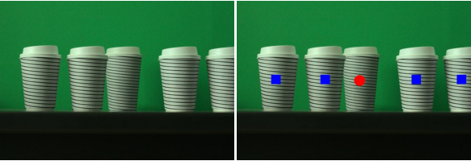
    <figcaption><em>
    Fig. 2. By adding markers, the target can be more easily referred to as "the object with red circle".
    </em></figcaption>
</figure>

With the segmentation masks produced by [kubric](https://github.com/google-research/kubric), we use the following script to automatically add markers:
```bash
# E.g. to mark the images in the Hugging Face subset 'kb-no-lp'
python dataaug.py --image_set 'hf-kb-no-lp-aug' --mark

# This generates a new image_set called 'kb-no-lp-mark' on the local disk.
```


#### Sampling Prompts
Code snippet for sampling new [visual questions](#visual-question-prompts):
```python
import expt

# 4 available question sets, corresponding to 4 levels of target referring clarity:
# depth-order-lowc-rand
# depth-order-medc-rand
# depth-order-highc-rand
# depth-order-highestc-rand

qset_name = "depth-order-highestc-rand"
question_set = expt.get_question_set(qset_name)
questions = question_set.list_questions()

# [Question(text='Is the object marked with a red circle behind or in front of the objects marked with a blue square? A. Behind. B. In front of. Answer A or B.', kind='closer_farther', clarity=4)]
```

### Experiments
#### Setup
Experiment code is grouped by model family under `src/vlm_*/`. Additional GPU setup may be required to run VLM experiments. We list general setup steps here. For detailed instructions, see the [QwenVL Docker Getting Started Guide (generated)](/src/vlm_qwenvl/docker/GETTING_STARTED.md).

1. Complete the [main Getting Started](#getting-started).
2. Install NVIDIA driver (We used `535.183.01` & CUDA `12.2`)
3. Build Docker image
    ```bash
    cd o3-d/src/vlm_qwenvl/docker
    ./build_docker.sh
    ```
4. Update paths in `run_docker.sh`
    ```bash
    CODE_FOLDER=/path/to/o3-d/          # absolute path to the repo root
    DATA_FOLDER=/path/to/o3-d/data/     # absolute path to your data directory
    ```

#### Running Experiments
Start a VLM container with
```bash
cd src/vlm_qwenvl/docker/
./run_docker.sh
```
Then, inside the container execute the following to run VQA experiments
```bash
python3 main.py --model_name Qwen2-VL-7B-Instruct-GPTQ-Int4 \
    --image_set hf-kb-1cue-aug \
    --question_set hf-visual-questions
```

Results will be saved at `<DATA_FOLDER>/results/<model_name>/*.pkl`, which can be loaded with `util.load_pickled_to_df(path)`.

##### Additional examples
If [locally augmented an image set with markers](#augmenting-images), you can also run
```bash
python3 main.py --model_name Qwen2-VL-7B-Instruct-GPTQ-Int4 \
    --image_set kb-no-lp-mark \
    --question_set hf-visual-questions
```

To run experiments with newly [sampled visual questions](#sampling-prompts):
```bash
python3 main.py --model_name Qwen2-VL-7B-Instruct-GPTQ-Int4 \
    --image_set hf-kb-1cue-aug \
    --question_set depth-order-higherc-rand
```

To query VLMs with in-context learning (ICL) or chain-of-thought (CoT), which only works with [newly sampled question sets](#sampling-prompts):
```bash
python3 main.py --model_name Qwen2-VL-7B-Instruct-GPTQ-Int4 \
    --image_set hf-kb-1cue-aug \
    --question_set depth-order-higherc-rand \
    --icl --cot
```

#### Available `image_set`s and `question_set`s

| `image_set` | Source | Compatible `question_set`s |
| --- | --- | --- |
| hf-kb-0cue-aug | [🤗HF](https://huggingface.co/datasets/liuyiqian/O3-D) | `hf-visual-questions`; `depth-order-{low,med,high}c-rand` |
| hf-kb-1cue-aug | ↑ | ↑ |
| hf-kb-2cue-aug | ↑ | ↑ |
| hf-kb-no-lp-aug | ↑ | ↑ |
| hf-real-012cue-aug | ↑ | ↑ |
| hf-real-mcue-aug | ↑ | ↑ |
| hf-real-012cue-mark | ↑ | `hf-visual-questions`; `depth-order-highestc-rand` |
| hf-real-mcue-mark | ↑ | ↑ |
| kb-0cue-mark | [local](#image-augmentation) | ↑ |
| kb-1cue-mark | ↑ | ↑ |
| kb-2cue-mark | ↑ | ↑ |
| kb-no-lp-mark | ↑ | ↑ |
| hf-real-012cue-cropped-aug | [🤗HF](https://huggingface.co/datasets/liuyiqian/O3-D) | `hf-visual-questions`; `depth-order-highc-lr` |
| hf-real-012cue-cropped-mark | [🤗HF](https://huggingface.co/datasets/liuyiqian/O3-D)  | `hf-visual-questions`; `depth-order-highestc-rand` |

- **`image_set` in our API is a different from *subset* on HF; one HF subset may contain multiple `image_set`s**
- `hf-` = available on huggingface; `-aug` = augmented images; `-mark` = marked images
- `↑` = same as above
- see [🤗Dataset Card](https://huggingface.co/datasets/liuyiqian/O3-D) for more details.

> [!NOTE]
> ICL / CoT (`--icl --cot`) is only supported with newly sampled questions (i.e., `depth-order-*c-rand` question sets).

> [!NOTE]
> To save space, marked synthetic images are not available on 🤗HF, thus need to be [locally generated](#augmenting-images) (i.e., `kb-*-mark` image sets).


### Evaluation
See [Analysis Notebook](analysis.ipynb).

## Glossary
Controlled pictorial cues

- OC: Occlusion
- LS: Light and Shadow
- TG: Texture Gradient
- LP: Linear Perspective
- HP: Height-in-Plane
- RS: Relative Size
- FS: Familiar Size
- SA: Saturation
- FO: Focusness

## BibTex
```bibtex
@misc{liu2026disentanglingpictorialcueunderstanding,
      title={Disentangling Pictorial Cue Understanding from Language Bias in VLMs via Depth Ordering Task},
      author={Yiqian Liu and Iuliia Kotseruba and John K. Tsotsos},
      year={2026},
      eprint={2607.01503},
      archivePrefix={arXiv},
      primaryClass={cs.CV},
      url={https://arxiv.org/abs/2607.01503},
}
```
