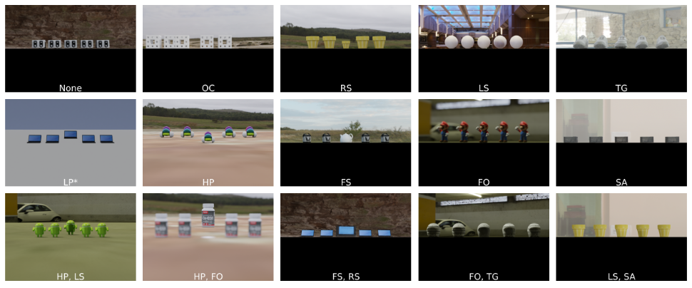

# O3-D Synthetic Image Generation
As part of the [main project](../../), this image generation pipeline:

- builds O3-D scenes with configurable environments, objects, and object positions;
- controls individual pictorial cues and their strengths;
- renders O3-D images, depth maps, and segmentation masks.


*Sampled O3-D synthetic images. For cue abbreviations, see [Glossary](#glossary).*


## Dependencies
- [Kubric](https://github.com/google-research/kubric)
- Docker

## Quick Start

```bash
git clone git@github.com:lyiqian/o3-d.git
cd o3-d/src/imggen

sudo docker run --rm --interactive \
    --user $(id -u):$(id -g) \
    --volume "$PWD:/kubric" \
    --mount type=bind,source=$PWD/..,target=/o3d_src \
    --env PYTHONPATH="${PYTHONPATH}:/o3d_src" \
    --mount type=bind,source=$PWD/../../data,target=$PWD/../../data \
    --env O3D_DATA_DIRPATH="$PWD/../../data" \
    --env DEBUG=1 \
    kubricdockerhub/kubruntu \
    python3 main.py \
    -p far -c HP
```

### Other example arguments
(see next section for descriptions of arguments)

One-cue, multiple cue strengths
```
-p near -c OC -s 1 2  # Target closer; Occlusion cue; std (1) and dbl (2) cue strengths
```

Two-cue
```
-p far -c OC RS HP TG -I 2 -s 1  # Target farther; 2-cue combos of {OC, RS, HP, TG}.
```


## Configuration via Command Line Arguments
*Note: for object and environment configs, check `SELECTED_OBJECTS` and `SELECTED_ENVIRONMENTS` in `main.py`.*

Core command line arguments

- `-p`, position of the odd object (aka target): `{none,far,near}`
- `-c`, pictorial cues to add: `[{TG,OC,HP,LS,FO,RS,SA,FS} ...]`. See [Glossary](#glossary)
- `-L`, `--elim_lp`, remove LP cue

- `-n`, number of distractors
- `-s`, `--cue_strength`, strength of pictorial cues
- `-S`, `--odd_scaler`, size scaler of the odd object
- `-I`, `--interaction_degree`, when specified, all possible `I`-cue combinations in the `-c` arg will be generated.
- `--resolution`, default to `512x512`


## Glossary
Controlled pictorial cues

- OC: Occlusion
- LS: Light and Shadow
- TG: Texture Gradient
- LP: Linear Perspective
- HP: Height-in-Plane
- RS: Relative Size
- FS: Familiar Size
- SA: Saturation
- FO: Focusness

## Bibtex
```bibtex
@misc{liu2026disentanglingpictorialcueunderstanding,
      title={Disentangling Pictorial Cue Understanding from Language Bias in VLMs via Depth Ordering Task},
      author={Yiqian Liu and Iuliia Kotseruba and John K. Tsotsos},
      year={2026},
      eprint={2607.01503},
      archivePrefix={arXiv},
      primaryClass={cs.CV},
      url={https://arxiv.org/abs/2607.01503},
}
```